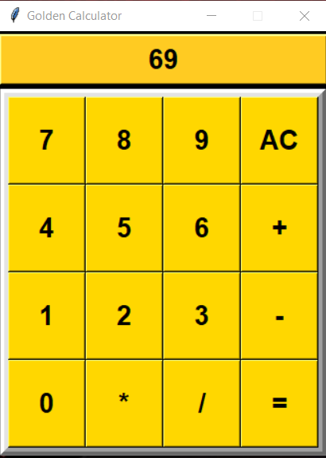

# 🧮 Golden_Calculator

Every programmer has tackled a calculator program at some point, but why settle for ordinary when you can create something unique? Introducing the Golden Calculator - a dazzling twist on a classic tool! With its stunning gold-white theme, it's not just functional; it's a feast for the eyes.

## 🛠️ Main Technologies

- `Python 3.x`
  - `tkinter`

## 🚦 Running the Project

To run the project in your local environment,Python must be installed on your system and follow these steps:

1. Clone the repository to your local machine or just copy-paste the code in `golden_calculator.py`.
2. Run `pip install tkinter` in the project directory to install the Tkinter library, which is usually included with Python installations.
3. Run `py golden_calculator.py` in terminal or click on run `▶️` button to get the project started.

## 🦄 Features

- **🖼️ UI**: The main feature of this calculator is its customized UI experience.The UI is designed with a golden theme, offering a visually appealing experience to users.

- **🧩 Functions**: it holds all basic calculator functions like addition, substraction, division and multiplication.

## 🔨 Implementation Details

- **🛎️ Button Press Functionality:** Each button press updates the display with the corresponding digit or operator.
- **🧹 AC (All Clear) Button:** Resets the display, allowing users to start a new calculation.
- **🥢 Equals Button:** Computes the result of the expression entered, displaying the outcome.
- **⚠️ Error Handling:** Provides error messages for division by zero or syntax errors.

  
## 👩🏽‍🍳 Process 🍳

I needed to create something unique, so I pondered and pondered...! Then, I noticed the calculator smiling at me from the table, and I thought, "How about a golden calculator?"

Why Golden?
Inspired by the allure of gold and the elegance of white, this calculator brings a touch of luxury to your everyday tasks. Who says math can't be glamorous?

Feel free to customize and extend this calculator application based on your requirements!

## 🤔 How Can It Be Improved?

- This calculator now supports only basic arithmetic operations and integer numbers. Floating-point numbers and more advanced functionalities like modulus operator and undo button can be added for further enhancement.

## 🐛 Current Bug

So far, I'm not really sure if there are any bugs. However, there might be some issues. I tested it out on my computer (Windows 10), and so far it looks good there.

## 🚀 Let's Get Started

Step away from the ordinary and embrace the extraordinary. [Download Golden_Calculator](https://github.com/malik-l0l/Golden_Calculator/raw/main/executable%20file/golden_calculator.exe)! and make your calculations shine brighter than ever before!

## 🍿 Preview

